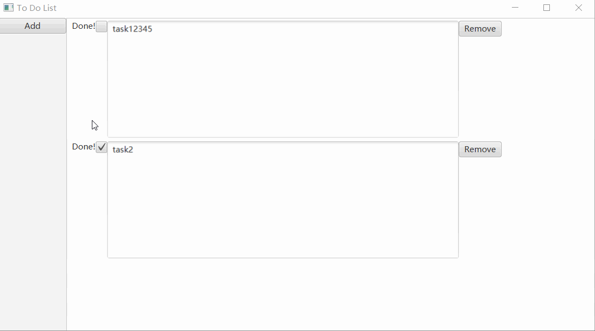
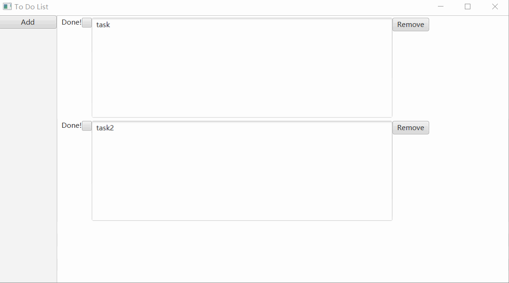
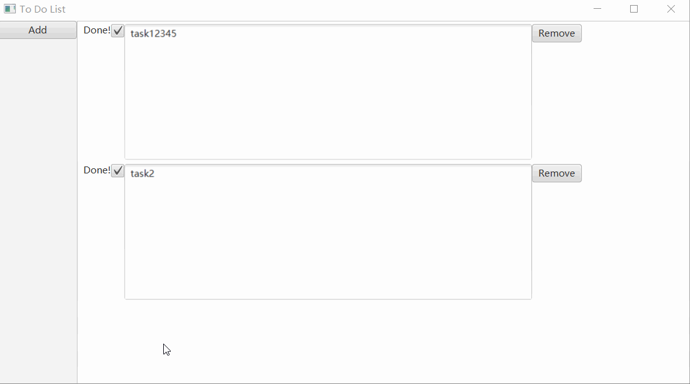

# ToDoList
 一个非常简陋的todoList
 基本功能已经全部实现，界面好丑就这样吧（逃
## 说明
  - 使用sqlite数据库
  - gui使用简单的javaFX
  - ~~现在主要工作是是实现DAO方法和交互逻辑~~ （已经完成）

## 使用方法
 - 直接编译
 - sqlite数据库需要放置到编译文件夹根目录
 - add按钮新增一个任务,remove按钮将任务从列表中移除
 - 修改任务说明直接编辑即可，所有操作会立即同步到数据库
 - 任务完成状态通过复选框变更
